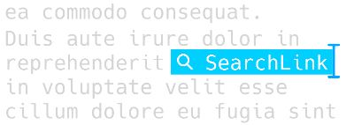

### Introduction

SearchLink is a System Service (Quick Action) for macOS which searches multiple web sources and automatically generates Markdown links for text. It allows you to write without leaving your editor to run web searches for the items you want to link to. It's great for blogging, and excellent for creating podcast show notes, among other things.

It works in a few ways:

- Run a quick search on a single selection, and have the selection replaced with the resulting url (and optional title) as a Markdown inline link, a Markdown reference, or just a plain url.
- Run a single search and have the results put on your clipboard, perfect for using from scripts and launchers (e.g. LaunchBar or Alfred).
- The "bracket" format, which allows you to just *write*, marking things to link as you go. When you're done, you can run it on the full document and --- if your queries were good --- have your links generated automatically without ever opening a browser.

This has replaced the "Auto-link web search" service in the [Markdown Service Tools](https://brettterpstra.com/projects/markdown-service-tools/ "Markdown Service Tools - Brett Terpstra"). The difference is that you can now mark links and specify how they should be searched, as well as provide alternate query terms for linked text.

Here's a video tutorial from Aaron Dowd ([@thepodcastdude](https://twitter.com/thepodcastdude)):

- 

Also see:

Accurate searches for better results:

Browser history, bookmarks, and Pinboard search:

### Documentation

The documentation has [moved to the wiki](https://github.com/ttscoff/searchlink/wiki).

### Download

There will likely be updates to this as I solve more problems, so keep an eye on this page for new versions. The current source code is [available on GitHub](https://github.com/ttscoff/searchlink).

SearchLink can also be installed via Homebrew, thanks to [@TomBen](https://github.com/TomBener):

	brew tap tombener/tap && brew install --cask searchlink

[Download SearchLink 2.3.65](https://github.com/ttscoff/searchlink/releases/latest/download/SearchLink.zip).

If you're interested in installing SearchLink as a command line tool, [see the wiki](https://github.com/ttscoff/searchlink/wiki/Using-From-The-Command-Line).

### Plugins

[plugins wiki]: https://github.com/ttscoff/searchlink/wiki/Plugins
[Plugins]: https://github.com/ttscoff/searchlink-plugins
[searches]: https://github.com/ttscoff/searchlink/tree/main/lib/searchlink/searches

All of [SearchLink's searches][searches] are defined using a [plugin architecture][plugins wiki]. You can see more examples and fodder for building your own in the [SearchLink Plugins repository][Plugins].

### Bonus for LaunchBar users

With the AppleScript below saved to `~/Library/Application Support/LaunchBar/Actions/Instant Search.scpt`, you can use SearchLink as a launcher for the web. Load the action in LaunchBar, type Space and enter a SearchLink simple query (just text with optional !arg at the beginning). When you hit Enter it will grab the first link and load it in the Open URL action. Enter again will open it in your browser, ???C will copy it to your clipboard.

Note that you don't need the normal "!!" at the end of the search string to specify that SearchLink should just return the URL, that's included in the script.

[View the Script](https://gist.github.com/ttscoff/9067625)

